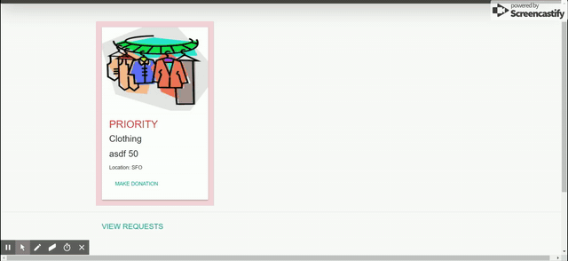

# Donation Station

## Summary
Donation Station easily allows organizations to donate goods. Those in need can also request items that can be prioritized based on urgency. 

## Overview and Structure
Part 1: Express App Using Handlebars and Sequelize
Part 2: React App Using MongoDB


## Installation Guide
* User has to download all files from GitHub repository
* User can either clone the repository or can download all files manually unzipping might take a while though
* `Package.json` file has required depencies to be installed. So, user can type `npm install` to install all needed packages
* User has to start mongo database as this application uses mongo database to store all books that are saved
* PC users can type `mongod` in separate bash terminal to kick start their mongo database
* User can type `node server.js` to start running the application(for express app)
* User can create a new react application by using `create-react-app <your app name>` (for react app)
* Once your react app is created, user can type `npm start` to run the application (for react app)

## Technologies Used
- MYSQL: Used for the many relationships in our app
- MVC: Models, Views, Containers
- JQuery: A library used for server communication
- Bootstrap: Used to help create the UI
- HTML: Backbone of the site
- CSS: For additional styling
- Mongo: Used for React application
- Node.js: Backend Server
- Notify.js: To send notifications to user

## Application Functioning
User has to login first to view all details. Then user can either make a donation or can make request for donation. User can also view all donations made to their particular donation request by clicking on view notification button. A part of application functioning is shown below



## Code Snippet
*View all requests/donation cards*

```Javascript
app.get("/:id", function (req, res) {
        console.log("Inside user login");
        console.log("ID");
        console.log(req.params.id);

        db.RequestorCard.findAll({
            where: {
                priority: 0
            }
        }).then(function (data) {

            db.DonatorCard.findAll({
                // order: db.DonatorCard.literal('enddate DESC')
                order: [['enddate', 'DESC']]
            }).then(function (result) {

                db.RequestorCard.findAll({
                    where: {
                        priority: 1
                    }
                }).then(function (priority) {

                    resultObj = {
                        priority: priority,
                        result: result,
                        requestorCards: data
                    }
                    // console.log(donatorCard.result);
                    console.log("MERGING RESULT OBJECTS");
                    console.log(resultObj);

                    if (login && req.params.id === uniqueUserId) {
                        console.log(uniqueUserId);
                        res.render("index", resultObj);
                    }
                    else {
                        console.log("Please Login First");
                    }
                })
            })
        });
    })
```
> The above code snippet renders an index handlebar file when `:/id` route is accessed. Here results from two different tables are wrapped in a single object to render a single handlebar file

*Notification*
```Javascript
    function showAcceptedRequests() {
        $.get("/api/acceptedrequests/" + userid, function (data) {
            console.log("Data from getting accepted request: ")
            console.log(data);
            for (var i = 0; i < data.length; i++) {
                var uniqueCardId = data[i].DonatorCardId;
                var uniqueButton = $("<button/>").append("Close");
                uniqueButton.data("userid", userid);
                uniqueButton.data("cardid", uniqueCardId);
                uniqueButton.attr("class", "btn-danger closeRequestNotification");
                $.notify({
                    title: "Your request of " + data[i].amount + " " + data[i].item + " has been accepted.<br>Please contact " + data[i].donatoremail + " to coordinate exchange.<br>Once you close this notificaiton, you will no longer be able to see this email address.",
                    button: uniqueButton
                }, {
                    style: 'notifications',
                    className: 'base',
                    autoHide: false,
                    clickToHide: false
                });
            }
        }).then(function () {
            showAcceptedDonations();
        })
    }
```
> The above code is to provide notification to users when their request/donation is being accepted or denied

*Authentication*
```Javascript
    app.get("/logout", function (req, res) {
        login = false;
        console.log(login);
        res.json(login);
    })

    app.get("/login/:uniqueUserId", function (req, res) {
        login = true;
        uniqueUserId = req.params.uniqueUserId;
        console.log(login);
        res.json(login);
    })
```
> This application provides authentication to users by preventing them from navigating between other user accounts

*React App*
```R
class Cards extends Component {
    state = {
        donatorCards: []
    };

    componentDidMount() {
        this.loadCards();
    }

    loadCards = () => {
        API.getAllCards()
            .then(res => {
                console.log("Inside get all cards");
                console.log(res.data);
                var arr = res.data;
                this.setState({ donatorCards: arr });
            })
    }

    }
```
> React app is populated with all donations that are made by users. The above code retrieves data from donation table and sets state so that it is available for other users to view

## Author Links
@Lex


@Jordan

@Mahisha
[LinkedIn](https://www.linkedin.com/in/mahisha-gunasekaran-0a780a88/)
[GitHub](https://github.com/Mahi-Mani)
